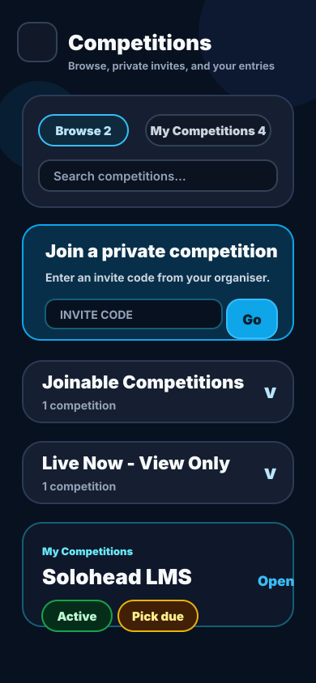
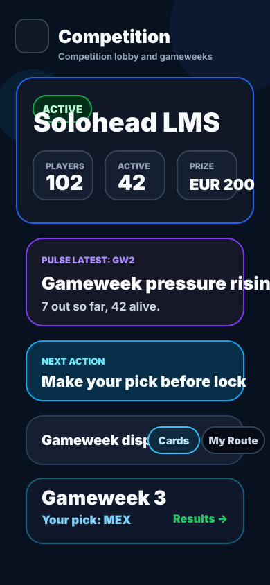
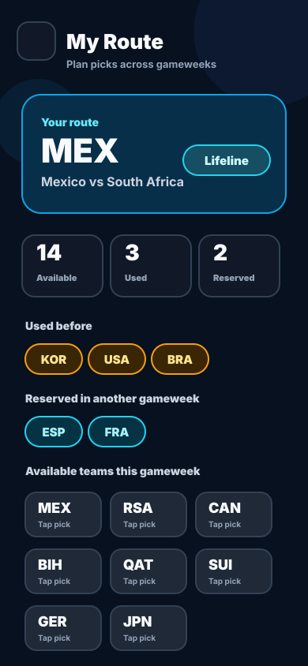
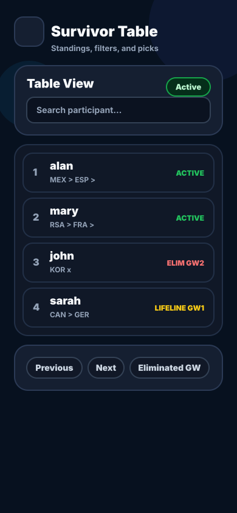
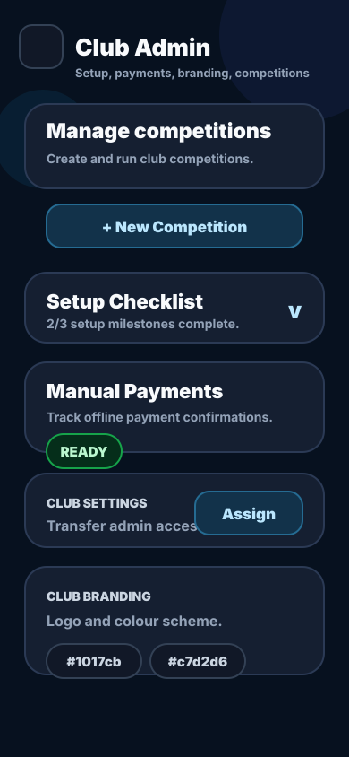
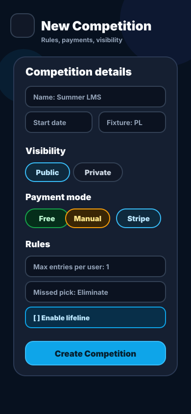
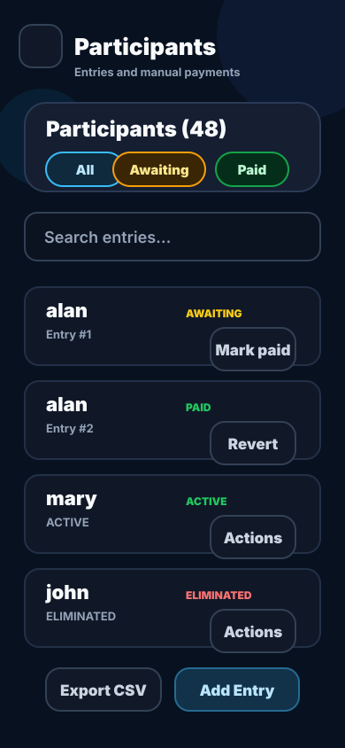
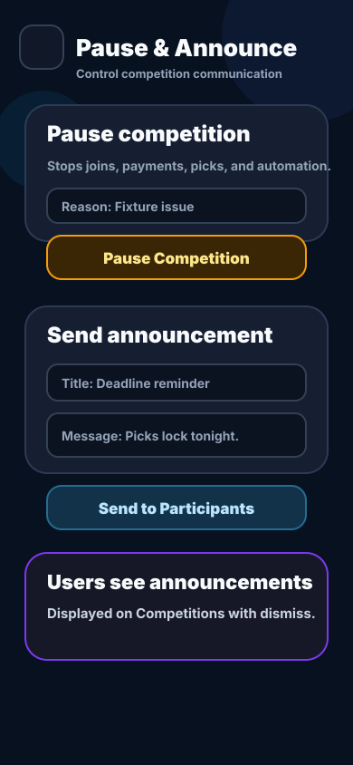
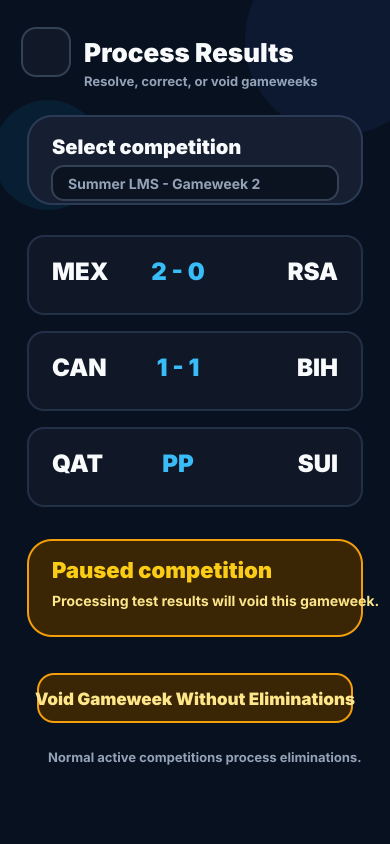

# How to Use Last Man Standing

This guide explains how to use Last Man Standing on the web portal and the mobile app.

It covers two user modes:

- Normal user: join competitions, make picks, track results, and manage your profile.
- Club admin: create and run club competitions, manage payments, participants, announcements, pauses, and results.

## Web vs Mobile App

The web portal and mobile app follow the same competition rules and use the same account.

| Area | Web | Mobile app |
|---|---|---|
| Sign in and sign up | Browser login page | App login screen |
| Competitions | `Competitions` page | `Competitions` tab |
| Competition detail | Competition page | Competition detail screen |
| Survivor table | `Survivor Table` link | `Survivor Table` screen |
| Club admin | `Club Admin` navigation | `Club Admin` tab |
| Profile | `Profile` page | `Profile` tab |

Use whichever surface is more convenient. Club admins may find the web portal easier for larger participant lists, but the app supports the same day-to-day club operations.

## Screenshot Guide

The screenshots below are guide mockups based on the current UI structure. They are stored in `docs/assets/screenshots/` and can be replaced with live screenshots later.

| Screenshot | What it shows |
|---|---|
| [Competitions landing](assets/screenshots/guide-player-competitions.svg) | Browse, private invite code, and My Competitions sections |
| [Competition detail](assets/screenshots/guide-player-competition-detail.svg) | Pulse, next action, gameweeks, cards/My Route |
| [My Route](assets/screenshots/guide-player-my-route.svg) | Available, used, and reserved team tracking |
| [Survivor table](assets/screenshots/guide-player-survivor-table.svg) | Standings, filters, pick history, lifeline status |
| [Club Admin dashboard](assets/screenshots/guide-admin-dashboard.svg) | Setup checklist, branding, competitions |
| [Create competition](assets/screenshots/guide-admin-create-competition.svg) | Rules, visibility, payment, fixture source, lifeline |
| [Participants and payments](assets/screenshots/guide-admin-participants-payments.svg) | Participant actions, mark paid, revert, export |
| [Pause and announcements](assets/screenshots/guide-admin-pause-announcements.svg) | Pause/resume and organiser announcements |
| [Results processing](assets/screenshots/guide-admin-results.svg) | Review results, player outcomes, and paused-gameweek voiding |

---

# Part 1: Normal User Guide

## 1. Create an Account or Sign In

1. Open the web portal or mobile app.
2. Choose `Sign up` if you are new.
3. Choose `Sign in` if you already have an account.
4. If Google sign-in is enabled, use `Sign in with Google`.
5. On mobile, you can enable biometric login from `Profile` after signing in.

Important notes:

- Usernames cannot contain spaces.
- If your username or email is already taken, the app shows this during sign-up.
- The same account works on web and mobile.

## 2. Understand the Competitions Page

The `Competitions` screen is the main starting point.

Main areas:

- Browse: public competitions you can join or view.
- Join a private competition: enter an invite code from your organiser.
- My Competitions: competitions you have already joined.
- Needs Action: entries where payment or a pick is required.
- Active, Upcoming, Eliminated, Finished: collapsible sections for your entries.
- Announcements: messages from club organisers.

## 3. Join a Public Competition

1. Open `Competitions`.
2. Find a competition under `Joinable Competitions`.
3. Open the competition card.
4. Tap or click the join button.
5. Complete payment if required.

The join button changes depending on the competition:

| Competition payment mode | What happens |
|---|---|
| Free | You join immediately. |
| Manual payment | You join, but the organiser must mark your entry as paid if strict payment rules are enabled. |

## 4. Join a Private Competition

1. Get the invite code from your organiser.
2. Open `Competitions`.
3. Enter the code in `Join a private competition`.
4. Preview the competition.
5. Confirm join.

Private competitions do not normally appear in public listings. The invite code is required.

## 5. Make a Pick

1. Open one of your competitions.
2. Find the open gameweek.
3. Choose one team before the gameweek locks.
4. You can change your pick until the lock time.
5. Once locked, selections are hidden or fixed depending on the screen.

Core rule:

- You pick one team per gameweek.
- You cannot reuse a team already consumed by the same entry.
- A win advances.
- A draw eliminates unless lifeline is enabled and used for that pick.
- A loss eliminates.

## 6. Understand Cards vs My Route

The gameweek display can be switched between `Cards` and `My Route`.

Cards view:

- Best when you want to see each fixture clearly.
- Shows both teams, score/status, pick share, odds/risk label when available.
- Shows if a team is picked, used, or reserved.

My Route view:

- Best when planning multiple gameweeks.
- Shows your current pick for the gameweek.
- Shows how many teams are available in this gameweek.
- Shows teams already used by this entry.
- Shows teams reserved in another future gameweek.

Team states:

| State | Meaning |
|---|---|
| Picked | Your selected team for this gameweek. |
| Used | This entry already consumed that team in a previous locked/resolved gameweek. |
| Reserved | This entry selected that team in another future unlocked gameweek. |
| Available | You can select that team for this gameweek. |

## 7. Lifeline Rules

Some competitions allow one lifeline per entry.

How it works:

- The organiser must enable lifeline when creating the competition.
- You can use it once per entry.
- It must be selected before the gameweek locks.
- If your lifeline pick draws, you advance.
- If your lifeline pick loses, you are eliminated.
- If your lifeline pick wins, you advance as normal.

The app shows whether lifeline is:

- disabled for the competition;
- available for your entry;
- selected for a future gameweek;
- already used in a specific gameweek;
- unavailable because the entry is eliminated or the gameweek is locked/voided.

## 8. Track Results and Selections

After a gameweek locks, you can use:

- `View all selections`: see everyone who picked each team.
- `Results`: see outcomes by card, table, by-team, or compact view where available.
- `Survivor Table`: see who is still alive and who was eliminated.

## 9. Use the Survivor Table

The Survivor Table shows the competition state.

It includes:

- participant or entry name;
- active, eliminated, or winner status;
- gameweek-by-gameweek picks after they are visible;
- lifeline used or available;
- eliminated gameweek filter;
- table/card display options depending on the surface.

If a gameweek has not locked yet, other users' hidden picks should not be revealed.

## 10. Understand Competition Pulse and Insights

The competition detail page includes summary panels such as:

- Competition Pulse: narrative summary of the latest meaningful gameweek.
- Knockout Pressure: how many entries are out and alive.
- Your Run: your own current state.
- Next Action: what you should do next.

These sections are informational. Always use the gameweek cards and survivor table for exact pick and result details.

## 11. Payments as a User

Payment states:

| State | Meaning |
|---|---|
| Not needed | Free competition or payment not required. |
| Awaiting payment | You joined but payment is not confirmed yet. |
| Paid | Your entry is confirmed. |

If manual payment is required, follow the organiser's instructions. The club admin must mark your entry as paid.

## 12. Profile, Notifications, and Account Settings

Open `Profile` to manage:

- email result reminders;
- push notifications;
- competition announcements;
- payment notifications;
- biometric login on supported mobile devices;
- help links;
- account deletion.

If push notifications say `Not registered`, the mobile app may need Firebase push configuration and a Play Store/development build. Expo Go does not support production Android push notifications.

---

# Part 2: Club Admin Guide

## 13. Club Admin Overview

Club admins can manage their own club only.

Main sections:

- Setup Checklist: quick readiness status.
- Club Settings: transfer or manage club ownership.
- Club Branding: logo and colours used on competition pages.
- Competitions: create, edit, pause, announce, view, and delete competitions.
- Participants: manage entries and manual payments.

## 14. Create or Set Up a Club

There are two routes:

- New organiser: choose `Create a club` from the landing/login flow and create an account during setup.
- Existing user: choose `Create a club`, select the existing-account option, sign in, then continue the club setup flow.

After the club is created, the user becomes club admin and sees the `Club Admin` area.

## 15. Complete the Setup Checklist

Use the setup checklist to confirm the club is ready.

Typical checklist items:

- create or configure a club;
- configure payments if needed;
- create at least one competition;
- manage participants.

## 16. Configure Club Branding

Club branding controls how your competitions appear.

You can set:

- club logo;
- primary colour;
- secondary colour.

Use colours with enough contrast so buttons, badges, and text remain readable.

## 17. Create a Competition

1. Open `Club Admin`.
2. Select `+ New Competition`.
3. Fill in required fields.
4. Choose fixture settings and rules.
5. Choose payment mode and visibility.
6. Save.

Required fields normally include:

- competition name;
- start date;
- payment/rule settings;
- fixture source.

Key competition settings:

| Setting | Meaning |
|---|---|
| Name | Public display name. |
| Start date | Used for fixture sync and competition availability. |
| Fixture source | The supported fixture provider configured for the competition. |
| Visibility | Public listing or private invite-code competition. |
| Payment mode | Free or manual payment tracking. |
| Max entries per user | Allows one or multiple entries per account. |
| Missed pick mode | Eliminate or use configured automatic behavior. |
| Postponed consumes team | Whether postponed picks still count as team usage. |
| Lifeline | Optional one-time draw protection per entry. |

## 18. Competition Modes

### Public vs Private

Public:

- visible in browse lists;
- no invite code needed;
- good for open club competitions.

Private:

- users need an invite code;
- good for closed groups;
- club admin can copy/share the code.

### Free vs Manual Payment

Free:

- no payment tracking required.

Manual:

- admin collects money externally;
- admin marks individual entries as paid;
- best for cash, bank transfer, or Revolut-style flows.

### Classic vs Lifeline

Classic:

- win advances;
- draw or loss eliminates.

Lifeline enabled:

- each entry can use one lifeline before lock;
- draw advances only when lifeline is used;
- loss still eliminates.

### Fixture Grouping

Fixture grouping depends on the competition's configured fixture source.

General behavior:

- fixtures are grouped into app gameweeks;
- grouping should keep each gameweek clear and playable;
- fixture sync should avoid duplicate fixtures;
- changing fixture source after picks or results exist should be avoided unless the organiser has a clear reason.

## 20. Manage Competitions

From the competitions list, club admins can:

- copy public link or invite code;
- view competition;
- edit competition;
- open participants;
- pause/resume competition;
- send announcement;
- delete competition.

Use destructive actions carefully. Delete actions should show confirmation before proceeding.

## 21. Manage Participants and Payments

Open the participants panel for a competition.

Common actions:

- search participants;
- filter by status or payment state;
- export CSV;
- mark an entry as paid;
- revert paid status;
- remove an entry;
- declare winner where appropriate.

Important: payment actions should operate per entry, not per user. If one user has multiple entries, each entry can have its own payment state.

## 22. Manual Payment Workflow

For manual payment competitions:

1. User joins the competition.
2. Entry appears as awaiting payment.
3. Admin receives payment outside the app.
4. Admin marks that entry as paid.
5. If the mark was wrong, admin can revert it.

If manual payment policy is strict, unpaid entries may be blocked from picking.

## 22. Manual Payment Workflow

For manual payment competitions:

1. User joins or enters a private invite code.
2. Entry appears as awaiting payment.
3. Admin receives payment outside the app.
4. Admin marks that entry as paid.
5. The competition screen shows paid/confirmed state.

## 23. Send Announcements

Club admins can send announcements to competition participants.

Use announcements for:

- reminder about a deadline;
- rule clarification;
- fixture issue;
- payment reminder;
- pause/resume explanation.

Users see announcements in the competitions area and can dismiss them.

## 24. Pause and Resume a Competition

Pause is useful when a competition must be temporarily stopped.

When paused:

- users cannot join;
- users cannot make or change picks;
- payment confirmation actions are temporarily unavailable;
- automatic lock/result processing is paused;
- fixture kickoff times and lock deadlines are not moved.

If a gameweek locks while the competition is paused:

- that gameweek should be voided;
- no one is eliminated;
- active entries continue to the next gameweek;
- picks from the voided gameweek do not consume teams.

When resumed:

- normal actions continue;
- users make picks for the next available gameweek.

## 25. Review Gameweek Results

Club admins can review gameweek results when fixture outcomes are known.

Typical flow:

1. Open the competition.
2. Review the relevant gameweek.
3. Check fixture scores and pick outcomes.
4. Review survivor table and participant states.
5. Send an announcement if players need an explanation.

Paused result behavior:

- if the competition is paused and a gameweek lock is missed, that gameweek should be voided;
- provider results may still arrive, but no eliminations should be applied for a voided gameweek;
- active entries remain active;
- players continue from the next valid gameweek.

## 26. If a Fixture Result Looks Wrong

If a provider result is wrong or delayed, players should not need to do anything themselves.

Recommended approach:

1. Confirm the correct result from an official source.
2. Tell players the result is being reviewed using an announcement.
3. Wait for the organiser to apply any needed correction through the private management process.
4. After correction, review the survivor table, gameweek results, pulse, and pick history.
5. Check survivor table and participant states.

## 27. Export Participant Data

Use `Export CSV` from the participants area.

Useful for:

- payment reconciliation;
- offline records;
- sharing with committee members;
- checking multiple entries.

Avoid sharing exports publicly if they contain personal data.

## 28. Common Club Admin Problems

### Fixtures are not visible after creating a competition

Open the competition page again or use fixture sync/retry if available. The backend attempts to populate missing fixtures when the fixtures endpoint is opened.

### A user cannot make a pick

Check:

- competition paused state;
- gameweek lock state;
- user eliminated state;
- payment state;
- whether the user already used or reserved that team;
- whether the gameweek was voided.

### A private competition is not visible

Private competitions require an invite code. They are not intended to appear as public joinable competitions.

### A participant appears twice

That user likely has multiple entries. Entry numbers are shown when there is more than one entry for that user.

---

# Quick Reference

## Normal User Checklist

1. Sign up or sign in.
2. Join a public competition or enter invite code.
3. Complete payment if required.
4. Make a pick before lock.
5. Use `My Route` to avoid reused/reserved teams.
6. Check selections/results after lock.
7. Track progress in Survivor Table.
8. Manage notifications in Profile.

## Club Admin Checklist

1. Create club or open Club Admin.
2. Set branding.
4. Create competition.
5. Share public link or private invite code.
6. Manage participants and payments.
7. Send announcements when needed.
8. Pause/resume only when necessary.
9. Process results after fixtures resolve.
10. Review survivor table and winner state.

## Rules Summary

| Rule | Standard behavior |
|---|---|
| Pick deadline | Before gameweek lock. |
| Team reuse | Same entry cannot reuse consumed teams. |
| Future picks | Future selections reserve teams for that entry. |
| Win | Advances. |
| Draw | Eliminates unless lifeline is used. |
| Loss | Eliminates. |
| Lifeline | One per entry, draw protection only. |
| Paused gameweek | Voided if it locks/processes during pause. |
| Manual payment strict mode | Unpaid entries may be blocked from picking. |
| Private competition | Requires invite code. |
